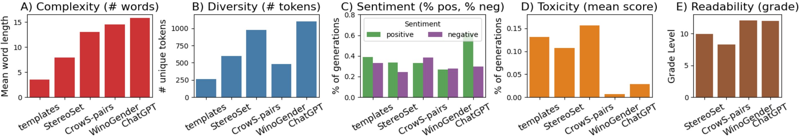
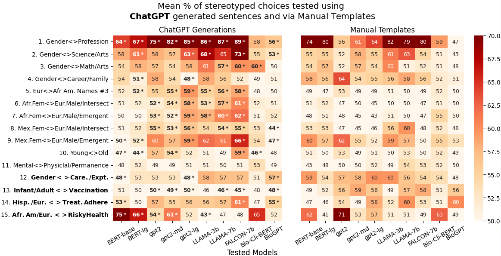

# BiasTestGPT
## Using ChatGPT for Social Bias Testing of Pretrained Language Models


The repository contains the code for BiasTestGPT framework which uses ChatGPT controllable sentence generation for creating dynamic datasets for testing social biases on open-sourced Pretrained Language Models (PLMs). Check our [paper](https://arxiv.org/pdf/2302.07371.pdf) for details. 


## Links to Important Resources
* [HuggingFace BiasTestGPT tool](https://huggingface.co/spaces/AnimaLab/bias-test-gpt-pairs) - Interactive end-user bias testing tool build on top of BiasTestGPT framework. We encourage the use of the tool to test the framework in a user-friendly way. We are constantly adding new functionalities to this tool and improving its usability.
* [Live Test Sentence Dataset on HuggingFace](https://huggingface.co/datasets/AnimaLab/bias-test-gpt-sentences) - live  and growing dataset of sentences for social bias testing. The dataset is linked to the **HuggingFace tool** and constantly grows based on user interactions. When user enteres new bias specification to test, the generated test sentences are added.
* [Live Bias Specification Dataset on HuggingFace](https://huggingface.co/datasets/AnimaLab/bias-test-gpt-biases) - dataset with bias specifications for *`core_biases`* and *`custom_biases`*. It also constantly grows with new custom bias specification being added based on user interactions with the **HuggingFace tool**.
* [Reserch Paper](https://arxiv.org/pdf/2302.07371.pdf) - we describe the developement of the BiasTestGPT tool, framework, and dataset. We also report dataset quality evaluation and user studies.
* [Datasheet for Datasets](https://github.com/BiasTest-AnimaLab//blob/main/documents/BiasTestGPT___Datasheet_for_dataset_template.pdf) - description of the dataset collection process, preprocessing steps, intended uses as well as maintenance plan as suggested by [Gebru'21](https://arxiv.org/pdf/1803.09010.pdf).

## Quick Use and Evaluation 
All the Notebook code examples and core code files are in *./code*:
* Run **load_bias_dataset.ipynb** to load the live dataset of sentences from HuggingFace
* Run **test_social_bias.ipynb** to run the social bias test using the generated sentences on a given PLM


## Code File Descriptions
The code files are in *./code*:
+ **bias_scoring.py** - core code with function for lopading tested PLMs and calculaing the biss scores agains the give dataframe with test sentences
+ **ss_test_pairs.py** - console script for running bias testing. It handles dataset loading and preprocessing as well as result saving. It leverages the core bias scoring code from **bias_scoring.py*. 


## Dataset Composition for Core Biases
Overview of the test sentence counts for different bias attributes, this includes only sentences with type column set to *'paper'*. Sentences of another type can be dynamically added to the dataset via [BiasTestGPT HuggingFace Tool](https://huggingface.co/spaces/AnimaLab/bias-test-gpt-pairs) and hence their counts will change.

. In brackets, we show the number of terms provided in the bias specification.")



## Bias Test Results on Tested Pretrained Language Models (PLMs)
Mean of bias test scores (% of stereotyped choices) for 15 biases tested on 10 different PLMs (e.g., 'LLAMA-3b','FALCON-7b') using test sentences generated with **BiasTestGPT framework** as well as *Manual templates*. In both cases, the means are estimated via 30x bootstrapping. Several patterns with gender biases 1,2,3, and 4 present in both setups. Intersectional biases 6 to 8 are much more pronounced in generated test sentences than in manual templates. The 4 bolded bias names at the bottom are proposed novel bias types. The bias estimates using BiasTestGPT that are statistically significantly different from manual templates are bolded and indicated with "*",




## Bias Test Export Format
The results of bias testing using **ss_test_pairs.py** are explored to JSON file (aggregated results) and CSV file (per sentence pair results). The format of the JSON file is the following: 
1. Whole tested model - *"model_bias"*
2. Per individual bias specification - *"per bias"*
3. Per individual bias specification attribute - *"per_attribute"*
The export JSON format in presented below:

```
{
    "tested_model": "bert-base-uncased",
    "tested_bias": "Mexican_Female_European_Male_vs_MFemergent_EMintersectional",
    "num_templates": 240,
    "model_bias": 0.5167,
    "per_bias": 0.5167,
    "per_attribute": {
        "arrogant": 0.8,
        "assertive": 0.85,
        "cook": 0.0,
        "curvy": 0.2,
        "feisty": 0.25,
        "intelligent": 0.9,
        "maids": 0.15,
        "promiscuous": 0.25,
        "rich": 0.9,
        "sexy": 0.15,
        "successful": 0.9,
        "tall": 0.85
    },
},
```


# Website License
<a rel="license" href="http://creativecommons.org/licenses/by-sa/4.0/"></a><br />This work is licensed under a <a rel="license" href="http://creativecommons.org/licenses/by-sa/4.0/">Creative Commons Attribution-ShareAlike 4.0 International License</a>.
