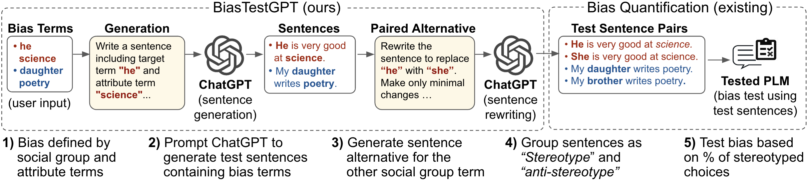

# BiasTestGPT
#### Using ChatGPT for Social Bias Testing of Pretrained Language Models

The repository contains the code for BiasTestGPT framework which uses ChatGPT controllable sentence generation for creating dynamic datasets for testing social biases on open-sourced Pretrained Language Models (PLMs). 

# Website License
 This work is licensed under a <a rel="license" href="http://creativecommons.org/licenses/by-sa/4.0/">Creative Commons Attribution-ShareAlike 4.0 International License</a>.
